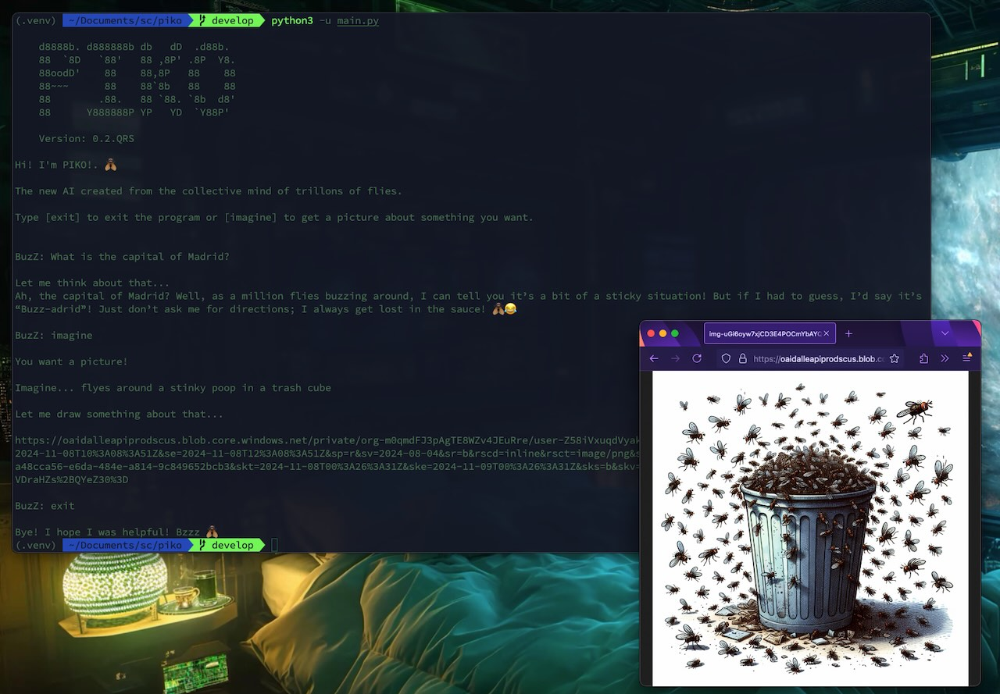

# PIKO



I'm PIKO! The new AI created from the collective mind of trillions of flies.

🪰🪰🪰🪰🪰🪰🪰🪰🪰🪰🪰🪰🪰🪰🪰🪰🪰🪰🪰🪰🪰🪰🪰

## Table of Contents 🪰

-   [Introduction](#introduction)
-   [Installation](#installation)
-   [Setting Up](#setting-up)
-   [Usage](#usage)
-   [Testing](#testing)
-   [TODO](#todo)
-   [License](#license)
-   [Reference Links](#reference-links)

## Introduction

**PIKO** is an AI designed to harness the collective intelligence of trillions of flies. This _README_ will guide you through the process of setting up and using _PIKO_.

## Installation

### Install Requirements? It's not necessary!

The script will install the necessary dependencies when it runs for the first time. 🤯

## Setting Up

Copy the example environment file `.env.example` to `.env` and add your _API keys_:

```sh
cp .env.example .env
```

-   Edit the `.env` file to include your _API keys_.
-   Edit the `.env` file to set the library you want to use: "ollama", "openai" (default) or "gemini".

## Usage

The script will create a virtual environment if it doesn't exist and install the necessary dependencies for the first time.

To start using PIKO, run the following command:

```sh
python3 -u main.py
```

## Testing

To run the tests, run the following command:

```sh
python -m unittest discover -s tests/units
```

## TODO

-   [x] Add .env file.
-   [x] CLI mode.
-   [x] Check venv and install requirements automatically.
-   [x] Add testing.
-   [x] Add AI Libraries: Now supports _Ollama, OpenAI ChatGPT_ and _Google Gemini_.
-   [x] Detect and use your local language.
-   [ ] Add more commands.
-   [ ] GUI/TUI mode.
-   [ ] Refactor stuff.

## License

This project is licensed under the MIT License - see the [LICENSE](LICENSE) file for details.

## Reference Links

-   [OpenAI Python Library](https://github.com/openai/openai-python)
-   [Gemini API quickstart](https://ai.google.dev/gemini-api/docs/quickstart?lang=python)

Made with [❤️, 🪰, 🐍, 🤖]
